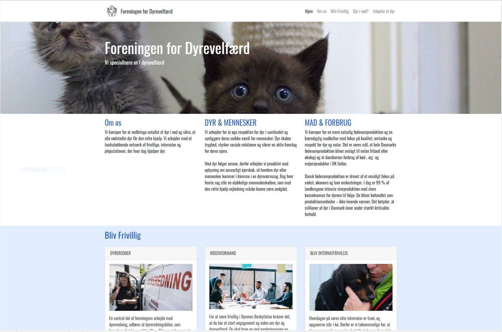

# Projektdokumentation
### Navn: Kasper Aleksander Birch
#### Holdnr: WUHF02<br>Uddannelse: Webudvikler<br>Uddannelsessted: Roskilde Tekniske Skole

<a href="https://www.google.com" target="_blank">Link til Dyrevelfærd's hjemmeside</a>
<br>
<a href="https://www.google.com" target="_blank">Link til login på Dyrevelfærd's hjemmeside</a>

> Brugernavn: admin<br>Adgangskode: 1234


## Applikation teknologi
Gatsby, React, Styled-Components, Netlify, Heroku

## Dagbog (gennemførelse af opgaveforløbet)
1. Dag<br>
Første dag er gået godt, jeg har læst opgaven igennem, hostet til Heroku, opsat gatsby med min egen template, og lavet næsten alle components inklusv css til frontpage

1. Dag<br>
idag har jeg skiftet placeholder-data ud med data der kommer fra api, ved at lave mit eget react-hook (useApi.js), details site, login formular der videresender mig til en anden formular, der kan tilføje et nyt dyr, og lavet slider med link til details

1. Dag<br>
Pagination, styled component med props, moments, media query, 

1. Dag<br>
Loading component, cleanup, updated slider, media query, 

1. Dag<br>
Dynamisk UserDasboard, Dokumentation

## vurdering af egen indsats
Jeg er meget tilfreds med min egen indsats, da jeg har arbejdet hårdt alle dage for at nå så langt som muligt. Jeg har i forbindelse med projektet løbet ind i flere udfordringer og har måtte bruge en del tid på fejlfinding, omskrivning af koder og at læse dokumentation om f.eks. Brugerdefinerede valideringsregler i React Hook Form og Dynamisk routing i Reach Router. 

Jeg synes det var en god og udfordrende opgave, hvor jeg har tilegnet mig en masse nye kompetencer i forbindelse med projektet. 


## Tredjeparts plugins

#### react-hook-form
> Jeg har brugt react-hook-form til at styre states og validering af forms

#### Axios
> Jeg har brugt axios til at Axios til at lave HTTP requests

#### Swiper
> Jeg har brugt Swiper til at lave en carusel

#### Moment
> Jeg har brugt moment til at beregne tid fra oprettelse til nu

## Argumentation for valg af løsninger
Jeg har valg at implementere Slideren på flere sider fordi den giver brugere en spænede måde integrere med sitet og et godt overblik over hvilke dyr der kan adopterets

## Beskrivelse af særlige punkter til bedømmelse
I filen src/hooks/useApi.js demonstrere jeg at jeg kan bruge de 2 vigtigste react hooks useState og useEffect. 

```
import { useState, useEffect } from 'react';
import axios from 'axios'

export default function useApi(url) {
    const [response, setResponse] = useState();
    const [loading, setLoading] = useState(false)
    const [error, setError] = useState(null)

    useEffect(() => {
        const fetchApi = async () => {
            try {
                setLoading(true)
                const response = await axios.get(url)
                setResponse(response.data);
                setLoading(false)
            } catch (error) {
                setError(error)
            }
        }
        fetchApi()
    }, [url])

    return [response, loading, error]
}
```

### useState 
Dette react hook er en funktion der retunerer en variable og en funktion til at ændre variablen. Syntaksen for useState er at deklarere en const, med et array med navnet på din variable, efterfulgt af navnet for din funktion til at ændre variablen. Typisk navngiver man funktionen med “set” efterfulgt af det samme navn som variablen har. Arrayet er = useState funktionen hvor du sætter dine standardværdier med som parametre.
```
const [state, setState] = useState(initialState);
```
### useEffect 
Dette react hook er en funktion med 2 parametre. Det første parametre er en callback function, og det andet er et array med inputs der kalder din callback function, hvis der er ændringer. Hvis du ikke tilføjer nogle indput kører scriptet kun en gang. 

useEffect bruges som et script der tilhøre et komponent. dette kan for eksempel bruges til at fetch data hvor du derefter gøre brug af din “Set” function fra useState til at gemme data i din variable. i dit callback har du også mulighed for en “cleanup” function til for eksempel at fjerne en eventlistener.   
```
  useEffect(() => {
    // write your code here
    console.log('render!');
    return () => {
      // write your cleanup code here 
      console.log('unmounting...')
    }
  }, [// ]);

```

## Bilag:
<a href="https://www.google.com" target="_blank">Kanban board</a>

